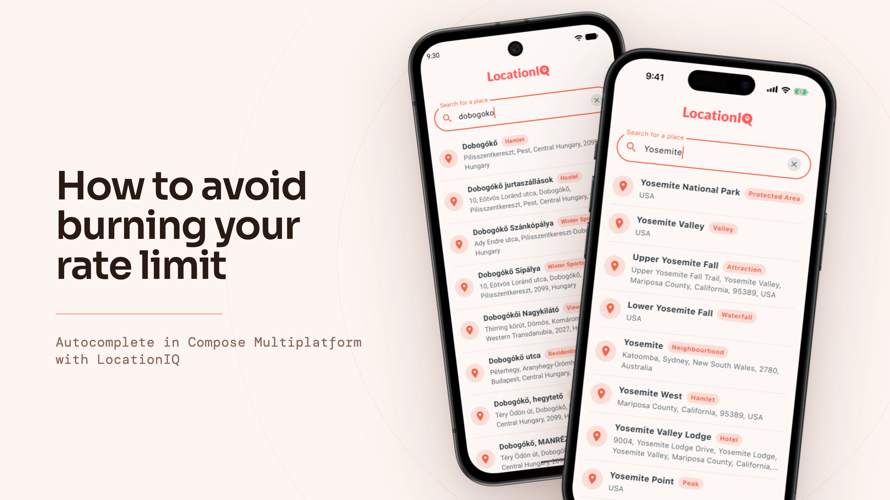
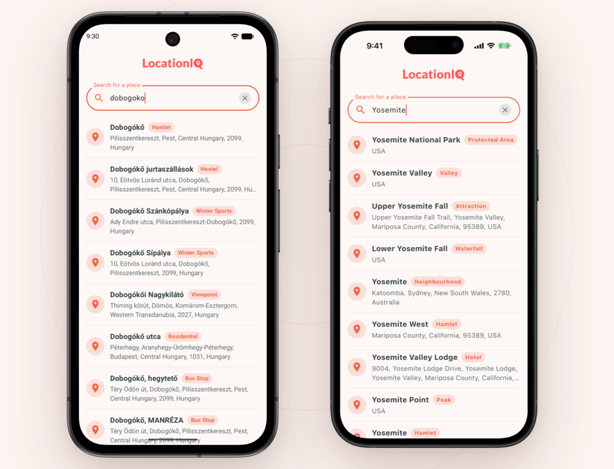
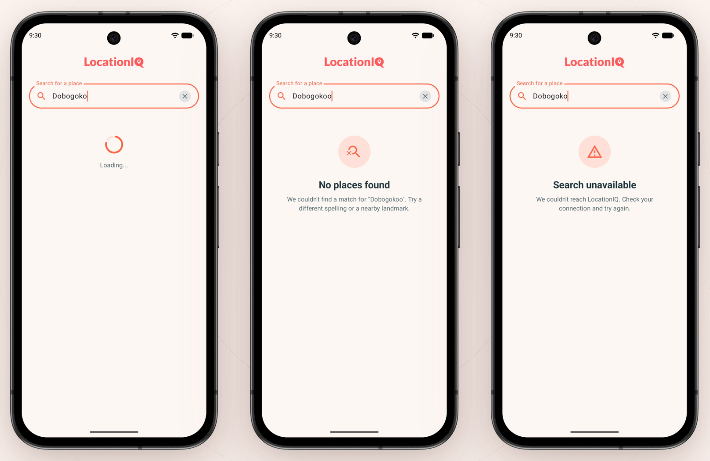

# How to avoid burning your rate limit - Autocomplete in Compose Multiplatform

Most of us in our career had to implement an autocomplete feature for place search. The post's goal is to demonstrate the "token-saving" best practices through a LocationIQ demo using Compose Multiplatform (Android & iOS).



## What you can learn from this post

- My background story and motivation
- Geocoding best practices to save tokens or de-load your the backend
- Finding the right OSM geocoding service
- Step-by-step guide to integrate LocationIQ autocomplete using Compose Multiplatform (Android + iOS)

## My background story and motivation

[HuKi - Hungarian Hiking Map](https://github.com/RolandMostoha/HuKi-KMP) is my pet project with an OpenStreetMap based map engine. It's a hiking app, so place search and geocoding are essential parts of most of my features.

HuKi is self-funded, and my ultimate goal is to keep my app free for anyone, so I had to:

- look for a geocoding service which has a free or low-budget option
- apply "token-saving" best practices for the geocoding service, so it only burns my rate limit when it's absolutely necessary

## Geocoding best practices to save tokens or de-load your backend

The chapter describes provider-independent best practices to minimize the number of calls to the geocoding service and hit the backend only if it's absolutely necessary. Fewer calls mean less tokens spent, more efficient work and less load on the backend, so no matter if you follow the self-hosted or paid service approach, the effort pays off.

### Before the request is fired

- **Trimming the input** - `"Budapest"` and `"Budapest "` are the same search, they should cost only one request.
- **No repeated queries** - never send the same query twice in a row.
- **Minimum character limit** - no request for queries shorter than 3 characters. They match half the planet anyways.
- **Debounce** - wait for ~1 sec while typing before you fire a request, so a quick typed 20-character place name costs one request instead of twenty.
- **Keep only the latest request** - when a new query arrives, the in-flight request is cancelled, so an outdated response never interferes with a fresh one.
- **Platform specific Autofill Framework for addresses** - increasing the chance of first-try results by typing exact addresses. Helping the user type exact addresses improves UX and can save calls.
- **Tap ahead pattern** - the usual "→" button in autocomplete, which prefills the full address. Same reason as the previous point.

### In the request

- **Narrow the search area** - `countrycodes`, `viewbox` and `bounded` keep results relevant, so the user does not need to refine and search again. In my example, restricting to `Hungary` is the ultimate "token-saving" approach.
- **Filter by place type** - `tag` drops place types your app does not care about.
- **Limit results** - `limit` set to the maximum of 20, so one request covers the list.
- **Server-side dedupe** - If supported, `dedupe=1` removes duplicate places before they reach the client, plus a client-side `distinctBy` because the server dedupe is best-effort.

### After the response

- **No automatic retry** - we leave the users to retry the call, and only if it makes sense. Debounce applies here as well.
- **Response caching** - keep recent `request → response` pairs in memory, so going back to a query you already searched costs no request.
- **Place object caching** - store the places the user already picked so recent places can be shown without another request.

## Finding the right OSM geocoding service

### Nominatim

The de-facto standard for the OSM world is [Nominatim](https://nominatim.org/). It's the official OpenStreetMap geocoder, and most 3rd party services are built on top of it.

It has a publicly available, free instance as well. I ruled it out because it doesn't have an Autocomplete API. What's more, it's even forbidden to use the public instance to build your own:

> Auto-complete search: This is not yet supported by Nominatim and you must not implement such a service on the client side using the API.
>
> - [Nominatim usage policy](https://operations.osmfoundation.org/policies/nominatim/)

So the only option would be self-hosting: a PostgreSQL + PostGIS database, an OSM import of the planet extract, and a mechanism to keep the data up-to-date. Since Nominatim doesn't have a built-in autocomplete service, that's also a big part of the effort.

### Photon

[Photon](https://github.com/komoot/photon) is an open-source geocoder by [komoot](https://www.komoot.com/), built for OpenStreetMap data using Elasticsearch. It also has a public free instance under https://photon.komoot.io/.

A big difference from Nominatim is that Photon supports autocomplete out of the box.

I was using the free instance in my production app from the beginning. The biggest downside I experienced was the reliability of the service. There were many times when the service was totally down, or had 10-20 sec response times.

Since Photon is open-source, hosting it yourself is absolutely an option. You should keep in mind the running costs though, which correlate with the area you want to cover in the planet.

### LocationIQ

I encountered [LocationIQ](https://locationiq.com/) when I was searching for an alternative.

LocationIQ is a commercial geocoding provider built on OpenStreetMap. Unlike the previous two, it's a hosted service only. Beyond the autocomplete endpoint this demo uses, it covers forward and reverse geocoding, map tiles, routing and a few more APIs.

LocationIQ has a free option to try it out before committing. It's also pretty developer friendly, has a clean API and [documentation](https://docs.locationiq.com/docs/).

The daily usage in the free package is quite generous, at the moment of writing:

- 5000 requests / day
- 2 requests / second
- 60 requests / minute

More details at https://locationiq.com/pricing.

What to watch out for is the per-minute/per-second limits which can be a technical challenge to overcome above a certain usage.

## Creating a Compose Multiplatform mobile app (Android and iOS)

The following section is a step-by-step guide to integrate LocationIQ using Compose Multiplatform (Android + iOS).



GitHub repository for the demo: https://github.com/RolandMostoha/LocationIQ-CMP-demo

The repository is meant to be **read commit by commit**. Each commit is one self-contained step that builds and runs.

- **`step-0`** - baseline, the "New Kotlin Multiplatform project" template from Android Studio
- **`step-1`** - search input UI and the `GeocodingViewModel` that handles user events
- **`step-2`** - debounce and a minimum character threshold before querying
- **`step-3`** - Ktor client, LocationIQ DTOs and the repository
- **`step-4`** - mappers from DTO to UI model, and the results list
- **`step-5`** - loading, error and empty states, `GeocodingRepository` extraction

### Getting an API key

Sign up and grab a token at https://locationiq.com/.

The API key goes on every request as a `key` query parameter. The demo keeps it in one place:

```kotlin
// LocationIqConfig.kt
internal const val LOCATIONIQ_API_KEY = "YOUR_LOCATIONIQ_ACCESS_TOKEN"
```

Please make sure not to commit the token to git if you use the demo as-is.

## Step-1: Search input UI and GeocodingViewModel

The step goal is to have a search field for place autocomplete that follows the Android / iOS platform conventions and a `GeocodingViewModel` that holds the search logic and owns the query state. No network call yet, just designing the UI and processing the input.

[Changes compared to step-0](https://github.com/RolandMostoha/LocationIQ-CMP-demo/compare/step-0...step-1)

The interesting part is the search input field, which has the following properties:

**`keyboardType = KeyboardType.Text`** - the default type.

**`imeAction = ImeAction.Search`** - return key reads "Search" instead of inserting a newline.

**`singleLine = true`** - a multiline field's return key always inserts a newline, we want to avoid that.

**`capitalization = KeyboardCapitalization.Words`** - matches how place names are written.

**`semantics { ContentType } = PostalAddress`** - address request for the registered Autofill framework. Works for Android only, iOS needs a wrapper with `.textContentType(.fullStreetAddress)`.

## Step-2: Autocomplete best practices

The goal is to put the request-saving operators between the text field and the search, so typing a place name costs one request instead of one per keystroke. The network call is simulated, so we can see the behavior without hitting the actual endpoint.

[Changes compared to step-1](https://github.com/RolandMostoha/LocationIQ-CMP-demo/compare/step-1...step-2)

Every keystroke is a potential HTTP request. These operators stand between the text field and the network, each one for a different reason.

Luckily, we can apply most of the best practices in a compact way using Kotlin Flow features:

```kotlin
init {
    _uiState
        .map { it.query.trim() }
        .filter { it.length >= MIN_QUERY_LENGTH }
        .debounce(DEBOUNCE_TIMEOUT)
        .distinctUntilChanged()
        .flatMapLatest { query -> search(query) }
        .onEach { result -> _uiState.update { it.copy(result = result) } }
        .launchIn(viewModelScope)
}
```

**`trim()`** - trimming the input, e.g. `"Budapest"` and `"Budapest "`.

**`filter`** - a two-letter query matches half the planet and still counts against your rate limit. Three characters is the usual floor.

**`debounce(X)`** - waits for X sec while typing before you fire a request, so a quick typed 20-character place name costs one request instead of twenty.

**`distinctUntilChanged()`** - drops a value equal to the one before it, so the same query is never searched twice. The order matters here: it sits *after* `debounce()` on purpose, where it only sees what is about to be searched.

**`flatMapLatest`** cancels the previous inner flow when a new query arrives, so only the newest request stays alive. Cancellation is what makes the newest query always win.

## Step-3: Networking, Ktor client, repository and DTOs

The goal is to replace the simulated search with real LocationIQ autocomplete calls - a Ktor client, a repository, the DTOs, and the query parameters that keep the results relevant. Results are displayed only as a string for now, since a more polished design will be coming in the next chapter.

[Changes compared to step-2](https://github.com/RolandMostoha/LocationIQ-CMP-demo/compare/step-2...step-3)

### Key parameters in the autocomplete API call

- **`tag`** → restricts the results to OSM `class:type` pairs, like `place:city` or `amenity:cafe`.
- **`viewbox`** & **`bounded`** → `viewbox` weights the results towards an area, `bounded` turns that preference into a hard filter.
- **`dedupe`** → returns one row where several OSM objects describe the same real place.
- **`importancesort`** → sorts by how important the place is instead of by distance only.

### Notable fields in PlaceDTO

- **`boundingbox`** → important to determine zoom for place type. A place and city POI obviously need different zoom levels.
- **`placeId`** → LocationIQ's own id, it is not stable across imports.
- **`osmId`** → only unique in combination with `osmType`, but even that pair is not always the place itself: for postal code results it can point to the parent city or suburb, and for interpolated house numbers to the parent street.

> The LocationIQ team does not recommend `osmType + osmId` alone as a unique identifier. For storing and retrieving places, they recommend either a hash of the request-and-response pair for caching, or an identifier built from `osmType + osmId + displayName`. The demo still uses plain `osmType + osmId`, which is fine for the purpose.

### Understanding place names and addresses

- **`displayName`** → the full address in one string, everything OSM knows about the place. Usually too long for a list row.
- **`displayPlace`** → only the name part, the city's name for a `city`, the road's name for a `highway`. This is the title line.
- **`displayAddress`** → the rest of the address, without what is already in `displayPlace`. This is the subtitle line.
- **`address`** → the same address in structured fields (`road`, `city`, `postcode`, `countryCode`...), for when you need one part on its own.

## Step-4: Mappers from DTO to UI model, and the results list

The goal here is to map the DTOs to a UI model the list can render, and show the results with a more "polished" design.

[Changes compared to step-3](https://github.com/RolandMostoha/LocationIQ-CMP-demo/compare/step-3...step-4)

[PICTURE OF THE RESULT LIST]

## Step-5: Loading, error and empty states

The final chapter's goal is to process everything that is not a successful result - loading, empty, rate limit and key errors. Also, for testability, maintainability and replaceability, we will extract the geocoding repository logic to a `GeocodingRepository` interface.

[Changes compared to step-4](https://github.com/RolandMostoha/LocationIQ-CMP-demo/compare/step-4...step-5)



### Most important errors to handle:

- **HTTP 404: NotFound** → no place was found for the query. It's not an error, the API answers this way.
- **HTTP 401: Unauthorized** or **403 Forbidden** → the key is invalid or not active yet.
- **HTTP 429: TooManyRequests** → one of the rate limits is hit, per second, per minute or per day.

### Flow changes

Step-5 introduced a few changes over Step-2:

- **`filter` becomes an `else` branch.** Because `filter` swallows short queries, so deleting `"bud"` to `"bu"` leaves stale results on screen. An explicit `PlacesResult.Idle` clears the behavior.
- **`debounce()` becomes a `delay()` inside `flatMapLatest`.** Because `debounce` swallows the wait window, leaving no moment to show a spinner. Emitting `Loading` first, then delaying, gives the same request-saving effect, because `flatMapLatest` cancels the delay on the next keystroke:

```kotlin
.flatMapLatest { query ->
    if (query.length < MIN_QUERY_LENGTH) {
        flowOf(PlacesResult.Idle)
    } else {
        flow {
            emit(PlacesResult.Loading)
            delay(DEBOUNCE_TIMEOUT)
            emitAll(search(query))
        }
    }
}
```

### Why you would extract a GeocodingRepository interface

Extracting a `GeocodingRepository` interface with the implementation of `LocationIqGeocodingRepository` has multiple benefits:

- **Testability** - the view model takes the interface, so a test can give it a fake repository.
- **Being service-independent** - as my story above shows, the service can be replaced for pricing, coverage or licensing reasons. With the interface it's just a new implementation, the rest of the app stays the same.

## Outro

Thanks for checking out this article. If you have suggestions or a best practice I left out, I'm happy to hear it.

## Links

- [LocationIQ-CMP-demo](https://github.com/RolandMostoha/LocationIQ-CMP-demo) - the repository for this post, one commit per step
- [HuKi-KMP](https://github.com/RolandMostoha/HuKi-KMP) - my hiking app, the reason for all of this
- [LocationIQ](https://locationiq.com/) - sign up for an API key
- [LocationIQ documentation](https://docs.locationiq.com/docs/)
- [LocationIQ OpenAPI spec](https://github.com/location-iq/locationiq-openapi-spec) - for generating the network layer and DTOs
- [LocationIQ pricing](https://locationiq.com/pricing) - the free package limits
- [LocationIQ Terms of Use](https://locationiq.com/tos) - attribution and licensing
- [Nominatim](https://nominatim.org/) - the official OpenStreetMap geocoder
- [Nominatim usage policy](https://operations.osmfoundation.org/policies/nominatim/) - why the public instance is not an option for autocomplete
- [Photon](https://github.com/komoot/photon) - komoot's open-source geocoder, self-hostable
- [Photon public instance](https://photon.komoot.io/) - the free instance
- [OpenStreetMap copyright](https://www.openstreetmap.org/copyright) - the attribution requirements behind all three
- [Ktor client setup](https://github.com/JetBrains/compose-multiplatform/blob/master/docs/Ktor.md) - the standard networking setup used in Step-3
