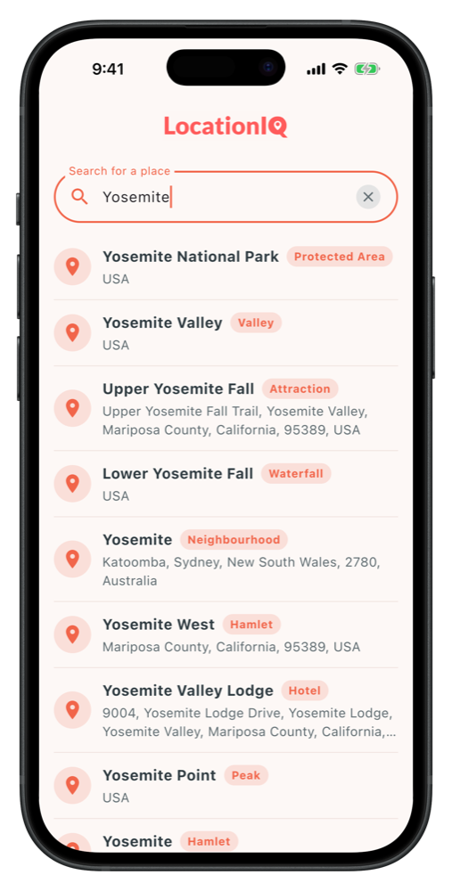
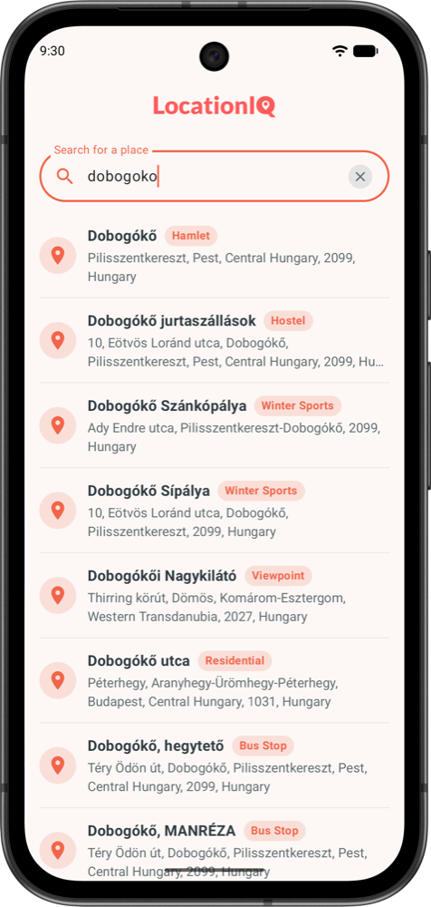

# LocationIQ Autocomplete with Compose Multiplatform

A small Compose Multiplatform demo that wires the
[LocationIQ Autocomplete API](https://docs.locationiq.com/docs/autocomplete) into an Android and iOS project.

Type a place, get autocomplete suggestions from **OpenStreetMap** by [LocationIQ](https://locationiq.com/) services.

## Goal

- Have a cross-platform project that runs on Android and iOS
- Apply best practices for autocomplete (minChar, debounce, etc.)
- Use shared code for the network layer with Ktor
- Implement the result view and handle loading, empty and error states

## Screenshots

|                      iOS                       |                      Android                       |
|:----------------------------------------------:|:--------------------------------------------------:|
|  |  |

## The steps

The repository is meant to be **read commit by commit**. Each commit is one self-contained step that builds and runs.

| Step | Tag      | What it adds                                                               |
|------|----------|----------------------------------------------------------------------------|
| 0    | `step-0` | Baseline - "New Kotlin Multiplatform project" template from Android Studio |
| 1    | `step-1` | Search input UI and the `GeocodingViewModel` that handles user events      |
| 2    | `step-2` | Debounce and a minimum character threshold before querying                 |
| 3    | `step-3` | Ktor client, LocationIQ DTOs and the repository                            |
| 4    | `step-4` | Mappers from DTO to UI model, and the results list                         |
| 5    | `step-5` | Loading, error and empty states                                            |

```bash
git checkout step-3           # jump to any step
git log --oneline --reverse   # read the steps as a table of contents
```

## Requirements

- **Android Studio** with the Kotlin Multiplatform plugin (a version that supports AGP 9.0)
- For iOS: **Xcode 16+** on an **Apple Silicon Mac**

### Quick setup

1. Install Android Studio and Xcode
2. Clone the repo and open the root project in Android Studio
3. Put your LocationIQ access token into `LocationIqConfig.kt` (see [LocationIQ API key](#locationiq-api-key))
4. Run the `androidApp` configuration on an emulator or device
5. For iOS, open [`/iosApp`](./iosApp) in Xcode and run it on a simulator

### LocationIQ API key

The demo needs a free LocationIQ access token.

1. Sign up at [locationiq.com](https://locationiq.com/) and copy your access token.
2. Paste it into `LocationIqConfig.kt` in the shared module, replacing the placeholder:

   ```kotlin
   internal const val LOCATIONIQ_API_KEY = "YOUR_LOCATIONIQ_ACCESS_TOKEN"
   ```

The constant is passed as a query parameter by the Ktor client — see step 3, where it is introduced.

> This file is tracked by git, so keep your own token out of any commit you push.

## Project structure

- [`/shared`](./shared/src) — everything shared across platforms, including the Compose UI:
    - [`commonMain`](./shared/src/commonMain/kotlin) — the UI, ViewModel, repository and models. Almost all of the
      demo lives here.
    - [`androidMain`](./shared/src/androidMain/kotlin) / [`iosMain`](./shared/src/iosMain/kotlin) — the small
      platform-specific parts (`actual` declarations, the Ktor engine, the iOS view controller entry point).
- [`/androidApp`](./androidApp/src/main/kotlin) — the Android entry point; a single `Activity` that calls the shared
  `App()`.
- [`/iosApp`](./iosApp/iosApp) — the iOS entry point; SwiftUI hosting the shared Compose UI.

## Running

- **Android**: use the run configuration in the IDE toolbar, or `./gradlew :androidApp:assembleDebug`
- **iOS**: open [`/iosApp`](./iosApp) in Xcode and run, or use the iOS run configuration in Android Studio

---

Learn more about [Kotlin Multiplatform](https://www.jetbrains.com/help/kotlin-multiplatform-dev/get-started.html),
[Compose Multiplatform](https://www.jetbrains.com/compose-multiplatform/)
and [LocationIQ](https://locationiq.com/).
